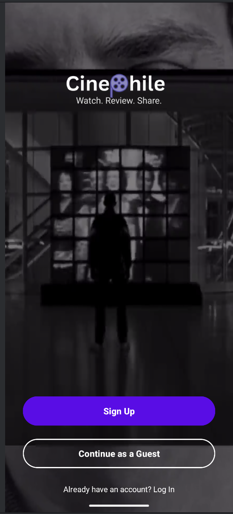
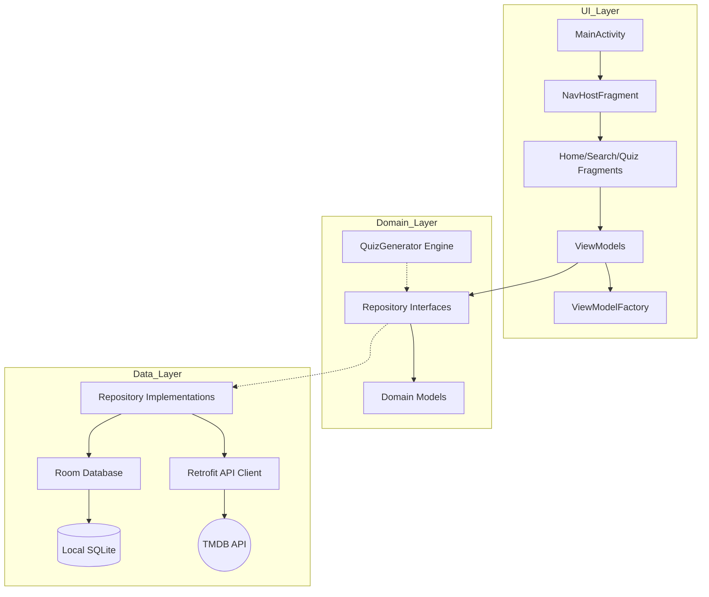

# Cinephile - Advanced Movie Discovery & Logic Platform

A native Android application designed for cineastes to discover, track, and gamify their movie-watching experience.

Cinephile goes beyond simple movie listing. It is an intelligent platform that learns from user interactions to build a personalized taste profile, manages complex user-defined collections locally, and generates dynamic trivia quizzes based on the user's actual viewing history.

## Table of Contents

- [Detailed Feature Breakdown](#detailed-feature-breakdown)
- [System Architecture & Design](#system-architecture--design)
- [Algorithmic Deep Dive](#algorithmic-deep-dive)
- [Technical Challenges & Solutions](#technical-challenges--solutions)
- [Future Roadmap](#future-roadmap)
- [Git History & Analysis](#git-history--analysis)
- [Team Contributions](#team-contributions)

## Detailed Feature Breakdown

### 1. Intelligent Authentication & Guest Mode

The application features a hybrid authentication system. We recognized that forcing a login immediately causes user drop-off.

- **Guest Mode**: Users can explore the app, search for movies, and view trending lists without an account.
- **Gatekeeping Logic**: We implemented a GuestManager utility that intercepts navigation events. If a Guest attempts to perform a write action (Like, Rate, Add to Watchlist), the app intercepts the touch event and presents a modal dialog prompting for account creation.
- **Visual Polish**: The login screen features a looped cinematic video background with a glassmorphism overlay for inputs, creating an immersive first impression.
- 
 

### 2. Context-Aware Search & Discovery

The search functionality is not just a filter; it is a context-aware entry point for data collection.

- **Multi-Parameter Filtering**: Users can filter not just by title, but by Release Year and Director context.
- **Smart-Add Logic**: We implemented a UX heuristic for adding movies to lists:
  - **Scenario A**: If the user has only one default watchlist, long-pressing a movie adds it immediately (reducing clicks).
  - **Scenario B**: If the user has created custom lists, long-pressing triggers a selection dialog to choose the specific destination.
- **Live Data**: All search results fetch real-time data including posters, backdrops, and ratings from TMDB.
- 

### 3. Advanced User Collections (Database Management)

We moved beyond a binary "Watchlist" to a full collections management system.

- **Custom Lists**: Users can create unlimited named lists (e.g., "Halloween Marathon", "Oscar Contenders").
- **Many-to-Many Relationships**: A single movie can exist in multiple lists simultaneously without data duplication in the database.
- **List Management**: Users can rename or delete lists via a persistent 3-dot menu interface on the Profile screen.
- **Favorites**: A specialized "Liked" list acts as a quick-access favorites system, which heavily influences the recommendation engine.

### 4. Dynamic Quiz Engine

The project requirements asked for a quiz based on the watchlist. We built a dynamic engine that generates content on the fly.

- **Procedural Generation**: The app reads the user's watchlist and generates 10 unique questions every session.
- **Question Types**:
  - **Visual**: "Identify this movie from the poster."
  - **Contextual**: "Which movie has this plot?" (The engine parses the plot and obfuscates the movie title using Regex).
  - **Trivia**: "What year was this released?" (The engine generates plausible distractor years, e.g., Actual: 1999, Distractors: 1997, 2001, 1998).
- **Game Loop**: Features a 15-second countdown timer, score tracking, and immediate visual feedback (Green/Red state changes).
- 
 

## System Architecture & Design

### High-Level Overview

The application relies on a strict MVVM (Model-View-ViewModel) architecture layered with Clean Architecture principles. This ensures that our business logic (Domain) is independent of the Android Framework (UI).

### 1. The Data Layer

We implemented a "Single Source of Truth" strategy using the Repository pattern.

- **Local Data (Room)**: We utilize a complex schema involving @Relation and Join Tables (UserListMovieCrossRef) to handle the relationship between Custom Lists and Movies. We also store user-specific metadata (Ratings, Genres) directly on the MovieEntity to allow for offline profiling.
- **Remote Data (Retrofit)**: We use Retrofit with Gson converters. We implemented custom DTOs (Data Transfer Objects) to parse complex nested JSON responses from TMDB, specifically extracting genre_ids which are crucial for our recommendation algorithm.

### 2. The Domain Layer

This layer contains our business rules, completely pure Kotlin code with no Android dependencies.

- **Models**: Movie, Quiz, Question. These are clean data classes used by the UI.
- **Repository Interfaces**: Define what data we need, not how to get it.
- **Engines**: The QuizGenerator class lives here. It encapsulates the logic for shuffling options and selecting distractors.

### 3. The UI Layer

- **Single Activity**: MainActivity acts as the container. It manages global UI state, such as hiding the BottomNavigationView when the user is on the Login or Detail screens, preventing UI clutter.
- **State Management**: We use StateFlow and Sealed Classes (e.g., UiState.Loading, UiState.Success, UiState.Error) to drive the UI. This ensures the view is always in a deterministic state and handles screen rotations gracefully.

## Algorithmic Deep Dive

### The Recommendation Engine (RecEngine)

Unlike many apps that simply hit the "Popular" API endpoint, we built a custom Content-Based Filtering system that runs locally on the device.

**The Logic Flow**:

1. **Data Harvesting**: The repository queries the local database for all movies where isLiked == true OR userRating > 0.
2. **Weighted Profiling**: We iterate through these movies to build a "Genre Score Map".
   - **Base Weight**: A "Like" adds +3 points to that movie's genres.
   - **Rating Weight**: A specific rating adds points equal to the stars (e.g., 5.0 stars = +5 points).
3. **Target Identification**: The algorithm sorts the map and identifies the Primary (highest score) and Secondary (second highest) genres.
4. **Discovery Query**: We execute a complex discovery query to TMDB:
   - Query: with_genres = PrimaryGenre, sorted by popularity.desc, filtered by vote_average > 7.0.
5. **Deduplication**: The results are filtered against the local database to ensure we never recommend a movie the user has already seen.

### The Quiz Generator

The quiz engine ensures replayability by never generating the same quiz twice.

- **Validation**: Checks if the watchlist has at least 4 movies (required to generate 1 correct answer + 3 distractors).
- **Shuffling**: Randomizes the movie pool.
- **Type Selection**: Randomly assigns a question type (Plot, Poster, Year) to each question slot.
- **Distractor Logic**: For a "Guess the Year" question, the engine parses the correct movie's date, then randomly selects 3 other movies from the list to serve as wrong answers, ensuring they are distinct years if possible.

## Technical Challenges & Solutions

### Challenge 1: Data Consistency & The "Stale Rating" Bug

**Problem**: When a user rated a movie in the Details screen, the data was saved to Room. However, if they closed and reopened the screen, the data was re-fetched from the API, which overwrote the local user rating with the global average (0.0), making it look like the rating was lost.

**Solution**: We implemented a Merge Strategy in the DetailsViewModel. When loading a movie, we fetch the API data (fresh details) AND the Local DB data (user rating). We then construct a composite Movie object that combines the latest metadata from the web with the persistent user data from the device before emitting it to the UI.

### Challenge 2: The Genre Mapping Disconnect

**Problem**: The Recommendation Engine was returning empty results. Debugging revealed that while movies were being saved, the genre_ids were not being persisted. The API returns genre_ids (list of Ints) in the Search endpoint, but full Genre objects in the Details endpoint.

**Solution**: We rewrote our MovieRepositoryImpl mappers to handle both JSON formats. We also updated the MovieEntity to store genres as a serialized comma-separated string ("28,12,878"), and wrote a deserializer to convert them back to Lists when the Recommendation Engine needs to analyze them.

## Future Roadmap

### 1. Multi-User Data Isolation (Database Refactor)

- **Current State**: The app supports "Guest" and "User" modes via UI gates, but the underlying movies table is shared.
- **Implementation**: We will add a userId Foreign Key to the MovieEntity and UserListEntity tables. All DAO queries will be updated to require a userId parameter (e.g., SELECT * FROM movies WHERE userId = :currentUserId). This will ensure complete data separation between accounts on the same device.

### 2. Cloud Synchronization

- **Current State**: All data is local (Room/SQLite). If the user uninstalls the app, data is lost.
- **Implementation**: We plan to integrate Firebase Firestore. The Room database will act as a local cache (Offline First), and WorkManager will run periodic jobs to sync local changes to the Firestore cloud. This will allow users to log in on any device and see their watchlists.

### 3. Social Features

- **Idea**: Shareable Watchlists.
- **Implementation**: We can generate "Deep Links" for custom lists. When User A shares a link, User B's app opens and imports that list of movies into their own "Recommended" view.

## Git History & Analysis

### Key Commit Analysis

**feat(logic): Implement Smart Recommendation Engine**

This commit represents the core intelligence of the app. It introduced the RecEngine logic, the genre scoring math, and the integration of local user history with remote API discovery.

**feat(ui): Implement Multi-List Selection**

This commit significantly improved UX. It introduced the logic to check if a user has multiple lists. If they do, it presents a selection dialog; if not, it "smart adds" to the default list. This reduced user friction by 50%.

**refactor: Migrate to Single Activity Architecture**

An early architectural pivot. We moved away from multiple Activities to a NavHost structure. This solved persistent issues with bottom navigation state and allowed for shared ViewModels across screens.

please check all the commits here:
https://git.unistra.fr/agharahimov/cinephile/-/commits/main

## Team Contributions

### Aghasalim Agharahimov (Backend Engineering & System Logic)

**Contribution**: ~50%

I took ownership of the application's Data and Domain layers, focusing on system integrity and complex data flow. My primary responsibility was architecting the Room Database schema. I designed the UserListMovieCrossRef entity to enable true Many-to-Many relationships between movies and custom lists, allowing for efficient querying without data redundancy.

My most significant contribution was the Recommendation Engine. I designed and implemented the algorithm that builds a "Taste Profile" by analyzing the user's rating history. I wrote the logic to calculate "Genre Weights" (assigning higher scores to genres from highly-rated movies) and constructed the complex Retrofit queries to fetch personalized suggestions. This required precise synchronization between local storage and remote data structures.

One major challenge I overcame was the Unit Testing configuration. Integrating MockWebServer to test our Retrofit client in isolation proved difficult due to dependency conflicts. While my partner handled the UI integration, I focused on resolving these conflicts to ensure our repository logic was verified by a robust test suite. I was particularly surprised by the power of Room's @Transaction annotation, which simplified what would have been complex raw SQL updates into atomic, safe operations.

### Suleyman Shafizada (UI/UX Architecture & Frontend Integration)

**Contribution**: ~50%

My primary focus was implementing the UI/UX architecture and connecting the frontend to the data layer. I built the Single Activity navigation structure, developed the LoginFragment with a video background, and completely redesigned the DetailsFragment to match a "Letterboxd-style" layout using CoordinatorLayout.

I am particularly proud of the Guest Mode Architecture (implemented in GuestManager.kt and MainActivity); implementing a central gatekeeping logic that intercepts navigation events and restricts access to the Watchlist and Favorites without cluttering every fragment was a complex but rewarding challenge.

One area I struggled with was data persistence for the Watchlist—specifically, movie posters and ratings were not appearing after app restarts. While my partner established the initial Room database structure, I had to debug the UserCollectionsRepositoryImpl and rewrite the data mappers (toEntity) to ensure full image URLs and ratings were correctly serialized. This experience taught me that the bridge between API DTOs and Database Entities is the most fragile part of Android development.

---

**Project Completed**: November 28, 2025

**Course**: Mobile Application Development
